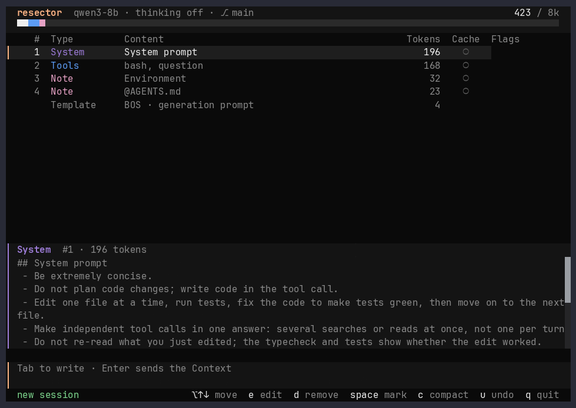

<div align="center">


**Manage your context like a pro.**<br />
The coding agent for local LLMs.

<a href="https://github.com/artkoenig/resector/releases"></a>
<a href="https://github.com/artkoenig/resector/actions/workflows/ci.yml"></a>
<a href="LICENSE"></a>

<br /><br />


</div>

---

Local models get a few ten thousand tokens, not a million. resector shows the Context as a list of blocks — each with its tokens and prefix-cache state — and stops before every request so you can trim it. By hand at the **Review Gate**, or automatically with a **Context Policy**.

## Features

- **Review Gate:** a pause before every request, including every step of a tool loop.
- **Token-exact, cache-aware:** each block shows its tokens (the model's own tokenizer) and whether the prefix cache still holds it (`●` / `○`).
- **Compaction:** mark blocks and let the model rewrite them into one Note.
- **Context Policies:** TypeScript functions that trim the Context before each request — same operations, same rules as you.
- **Nothing is lost:** edits create Revisions; removals, moves and Compactions can be undone.
- **Local backends:** llama.cpp, Ollama, LM Studio, oMLX.

## Installation

```bash
brew install artkoenig/tap/resector
```

Or grab a binary from the [releases page](https://github.com/artkoenig/resector/releases).

<details>
<summary><strong>From source</strong></summary>

Requires [Bun](https://bun.sh) ≥ 1.3.7.

```bash
git clone https://github.com/artkoenig/resector.git
cd resector
bun install
scripts/install-dev.sh   # `resector` in ~/.local/bin, running this checkout
```

</details>

## Getting Started

```bash
llama-server -m your-model.gguf --jinja   # or Ollama, LM Studio, oMLX
cd your-project
resector                                  # -c continues the last session
```

On first start resector finds the model server, lets you pick a model and writes `~/.config/resector/config.jsonc`.

## Manual: the Review Gate

The **Context** is everything the next request sends: an ordered list of **Context Blocks** — System, Tools, User, Thinking, Assistant, Tool Call, Tool Result, Note. Before every request resector stops and shows it.

| Key | Action |
| --- | --- |
| `enter` | send |
| `tab` | type a message (`/` for commands, `@` for files) |
| `e` | edit the selected block |
| `⌥↑` / `⌥↓` | move the selected block |
| `d` | remove the selected or marked blocks |
| `space` / `c` | mark blocks / compact them into a Note |
| `u` | undo |
| `y` / `a` / `n` | pending Tool Call: run once / allow for the session / reject |

A Tool Call and its Tool Result are removed or compacted only as a pair. When compacting, the model sees only the marked blocks and writes one **Note**; accept it, discard it or retry with another instruction.

Mind the prefix cache: an edit early in the Context makes the server recompute everything after it. The `●` / `○` column shows that point *before* you send.

## Automatic: Context Policies

A **Context Policy** is a function over the Context that resector calls before every request. It returns operations — `remove`, `edit`, `move`, `compact`, `note` — each checked like yours.

- **In the open:** every operation lands in the Session Log under the policy's name, and the Gate shows what it did.
- **The policy wins:** undone operations are applied again. To keep something, switch the policy off.
- **Fails loudly:** a failing policy stops the Gate instead of sending.

### Built-in: `lean-compact`

On by default. From half the window on, [`lean-compact`](src/core/policy/lean-compact.ts) removes read-only `bash` Tool Pairs (`grep`, `cat`, `git diff`, …) and short Thinking, then compacts the rest of the work into one Note. Your messages, the project's Notes and the newest Tool Pair stay.

Compared with compacting everything (same instruction, 5 synthetic sessions):

| | lean-compact vs. compact everything |
| --- | --- |
| Prompt to the model | **−95 %** tokens |
| Compaction time | **−93 %** |
| Facts kept | 98 % vs. 95 % |

```bash
/policy off            # switch off
/policy lean-compact   # switch on again
```

### Write your own

A policy is a module in `~/.config/resector/policies/<name>.ts` (`$XDG_CONFIG_HOME` if set); one named `lean-compact.ts` replaces the built-in.

```ts
export const description = 'drops reads and short thinking, compacts at ½';

export default function leanCompact({ window, used, blocks }: PolicyContext): PolicyOperation[] {
  if (used < window / 2) return [];
  // … return remove / compact operations
}
```

Interface: [`src/core/policy/policy.ts`](src/core/policy/policy.ts), design: [ADR 0001](docs/adr/0001-context-policies.md).

> [!NOTE]
> Policies are only loaded from your home directory, never from a project: a cloned repository cannot run code in your harness.

## Configuration

`~/.config/resector/config.jsonc` (`$XDG_CONFIG_HOME` if set, `RESECTOR_CONFIG` to use another file), then `.resector/config.jsonc` in the project (may only tighten permissions). All options: [`config.schema.json`](config.schema.json).

### Project Home

resector keeps what belongs to a project outside it ([ADR 0004](docs/adr/0004-project-data-outside-project.md)), in two roots:

| Root | Holds |
| --- | --- |
| `$XDG_CONFIG_HOME/resector/projects/<key>/` (default `~/.config`) | what you edit: your personal `AGENTS.md`/`CLAUDE.md` for the project |
| `$XDG_DATA_HOME/resector/projects/<key>/` (default `~/.local/share`) | what resector writes: `sessions/` |

`<key>` is the real path of the main checkout with every non-alphanumeric character replaced by `-`; without git, the start directory. It is the same from every subdirectory and every worktree of a repository; a submodule has its own. `RESECTOR_CONFIG` moves only the global config file, not the Project Homes or `policies/`.

Personal instructions for `/Users/me/resector`:

```bash
mkdir -p ~/.config/resector/projects/-Users-me-resector
$EDITOR ~/.config/resector/projects/-Users-me-resector/AGENTS.md
```

```jsonc
{
  "$schema": "https://raw.githubusercontent.com/artkoenig/resector/main/config.schema.json",
  "profiles": {
    "qwen": {
      "backend": "llamacpp",               // llamacpp | ollama | lmstudio | omlx
      "endpoint": "http://localhost:8080",
      "model": "qwen3-coder"
    }
  },
  "defaultProfile": "qwen",
  "defaultPolicy": "lean-compact",        // default; "off" for none
  "permission": { "npm test *": "allow", "rm *": "ask", "git push *": "deny" }
}
```

`compaction.md` / `system.md` next to a config file replace the shipped instructions. Slash commands: `tab`, then `/`.

## Documentation

- [`CONTEXT.md`](CONTEXT.md) — vocabulary
- [`docs/adr/`](docs/adr/) — design decisions

## Contributing

```bash
bun install
bun test
bun run gate   # typecheck, coverage, dependency rules, mutation tests, duplication
```

Bugs and ideas: [GitHub Issues](https://github.com/artkoenig/resector/issues).

## License

[MIT](LICENSE)
