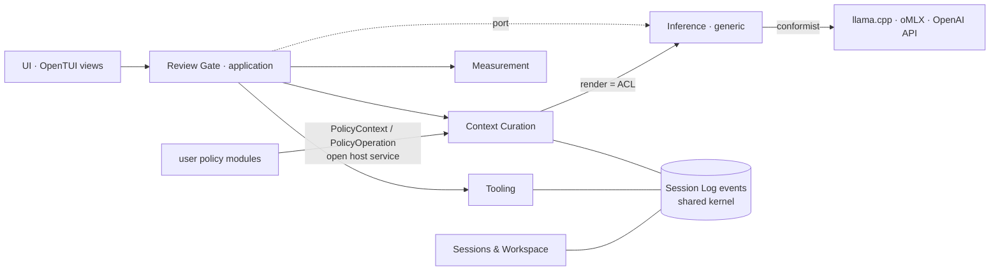

# Strategic design

Status: proposal (2026-09-30). Subdomains, bounded contexts and their relations, measured against the code as it is, and the steps that close the gap. Terms are those of [CONTEXT.md](../CONTEXT.md).

## Vision

Resector lets the user see, measure and edit everything sent to a local LLM with a small window. The value is **curation of the Context** at the **Review Gate**, backed by measurement; talking to model servers, running shell commands and storing files are means to it.

## Subdomains

| Subdomain | Type | Why | Code today |
|---|---|---|---|
| Context Curation | **core** | The product: Context Blocks, Revisions, Context operations, Compaction, Context Policies, Notes, replay of the Session Log. | `core/log`, `core/context`, `core/compaction`, `core/policy`, `core/notes` |
| Review Gate | **core** | The request cycle the user steers: send, stream, decide Tool Calls, hold, stop, go on. | `ui/gate/*.ts` (!) |
| Measurement | supporting | Needed to judge the Context, but its numbers come from the backend's tokenizer and cache; the product decides nothing on its own there. | `core/tokens`, `core/cache` |
| Tooling | supporting | Needed, not differentiating: tool catalog, Tool Call parsing, Permission Rules, Question, running bash/search. | `core/toolcall`, `core/approval`, `adapters/bash`, `adapters/search` |
| Sessions & Workspace | supporting | Session list/resume/title, config and Model Profiles, project files, environment, git worktree. | `core/session`, `core/config`, `adapters/store`, `adapters/fs`, `adapters/git` |
| Inference | generic | OpenAI-compatible chat, chat templates, tokenizers, server slots. Others solve it; we conform. | `core/render`, `core/backend.ts`, `adapters/backend` |

## Bounded contexts

One ubiquitous language covers Curation, Gate, Measurement, Tooling and Sessions: they share Context Block, Kind, Tool Call, Session Log. **Inference is the only context with a different language** (message, role, chat template, slot, KV cache) and it is generic. So: keep **one `CONTEXT.md`** (group its terms by context), no `CONTEXT-MAP.md`. The contexts are modules with dependency rules, not separate models.



| Relation | Pattern | Where |
|---|---|---|
| Curation, Tooling, Sessions ↔ Session Log | **Shared kernel** | `core/log/events.ts`, `core/log/fold.ts`; imported by nearly every module. Keep it small and stable. |
| Curation → Inference | **Anti-corruption layer** | `core/render/*` translates Context Blocks into `Request` (messages, roles). Nothing else should build messages. |
| Inference → model servers | **Conformist** / published language | OpenAI chat format; `adapters/backend/*` conform to each server. |
| User policy modules → Curation | **Open host service** / published language | `PolicyContext` in, `PolicyOperation` (zod schema) out; stable contract for `~/.config/resector/policies/*.ts` (ADR 0001). |
| Gate → Tooling | Customer / supplier | Gate asks for a Verdict and a Runner; Tooling knows nothing about the Gate. |
| UI → Gate | Customer / supplier | UI renders Gate state and calls its actions. |

## Findings

**F1 — The core process lives in the UI.** Send, tool loop, Tool Approval flow, policy passes and Compaction orchestration (`ui/gate/*.ts`, ~1.4k LOC) are the Review Gate context, but sit under `ui/`, mixed with view state (selection, marks, Kind Filter, `follow`). The most important behaviour is testable only through rendered frames (the 30 s suite). The gate slices import `ui/format` (`errorText`, `count`, `formatTokens`, `titleOf`, `thinkingLabel`).

**F2 — Dependency direction broken at the Gate.** `ui/gate/types.ts` imports `Clipboard` and `Branches` from adapters; `ui/gate/edits.ts` and `ui/gate/git.ts` import adapter modules. Ports belong to their consumer (as `Backend`, `Runner`, `SessionLog` already do in core).

**F3 — Shared kernel carries Gate view state.** `fold.Block` holds domain state (kind, content, revision, pair) and Gate state (`moved`, `revised`, `removed` "struck through until the next request", `missing` "set at the Gate", `title`). Every context depends on all of it.

**F4 — Tooling has no home module.** `core/toolcall/bash.ts` is named after one tool but holds the tool catalog, Tools Block content, raw-call parsing, result text and the `Runner` port. It is imported by `context/operations`, `render`, `session`, `backend.ts`, the Gate and `ui/format`.

**F5 — Messages built outside the ACL.** `core/compaction/compaction.ts` (`compactionRequest`) assembles role messages itself instead of going through `core/render`.

**F6 — Glossary gaps.** _Resolved 2026-09-30: terms added, `CONTEXT.md` grouped by context; Review Gate and Context Policy definitions corrected to match the code._ Used in code and UI, missing from `CONTEXT.md`: Permission Rule, session allow rule ("allow for session"), auto-approve, `@path` reference (unread → snapshot), environment Note, project instructions, session worktree, budget / drift, prefix cache (warm blocks), opening blocks, held results / stop. `CONTEXT.md` also carries an implementation detail (key `t` under Model Profile).

## Target layout

```
src/core/        domain, no I/O (rule unchanged)
  log/ context/ compaction/ policy/ notes/     Context Curation (+ shared kernel in log/)
  tokens/ cache/                               Measurement
  tools/ approval/                             Tooling (tools/ was toolcall/)
  render/ backend.ts                           Inference ACL + port
  session/ config/                             Sessions & Workspace
src/gate/        Review Gate application layer: workflow, its state, its ports. No TSX, no adapters, no ui/.
src/adapters/    implement ports of core and gate
src/ui/          OpenTUI views and view state (selection, marks, Kind Filter, keys, hints)
```

Dependency rules: `ui → gate → core`, `adapters → core | gate` (types only), composition root (`ui/launch.tsx`, `ui/start.tsx`) wires adapters into the Gate. `core` imports nothing outside `core`.

## Roadmap

Each step is small, keeps `bun test` green and can land alone.

1. ~~**Glossary**~~ — done.
2. **Architecture test** — a `bun test` that reads imports and asserts the dependency rules above; known violations in an allowlist that only shrinks.
3. **Ports at the Gate** (F2) — declare `Clipboard` and `Branches` in the Gate's types; adapters implement them. Move `errorText`, `count`, `formatTokens` out of `ui/format` to where the Gate owns its status texts.
4. **Extract `src/gate/`** (F1) — move the workflow slices (kernel, send, tool-loop, policy, compaction, edits, rules, settings, git, commands); leave selection, marks and Kind Filter in `ui/`. The Gate announces "focus this block" instead of calling `follow`. Workflow tests move from frames to plain unit tests. Record as ADR (keeps solid-js signals as the Gate's reactive state; see Q2).
5. **`core/tools/`** (F4) — split `toolcall/bash.ts` into catalog (definitions, Tools Block content), call (parse, arguments, result text) and the `Runner` port.
6. **Slim the kernel** (F3) — `fold` returns the domain Context; the Gate derives its view (changed since the last request, missing files, titles) on top.
7. **ACL only** (F5) — `compactionRequest` moves into `core/render`.

## Open questions

- ~~Q1~~ Measurement is supporting (decided 2026-09-30).
- ~~Q2~~ The Gate application layer keeps solid-js signals (decided).
- ~~Q3~~ One `CONTEXT.md`, grouped by context (decided).
- ~~Q4~~ Terms resolved in `CONTEXT.md`: Permission Rule, Session Rule, Auto-approve, File Reference, Environment Note, Project Instructions, Session Worktree, Budget, Warm Block, Tool Loop, Hold. Drift and opening blocks stay implementation terms.
